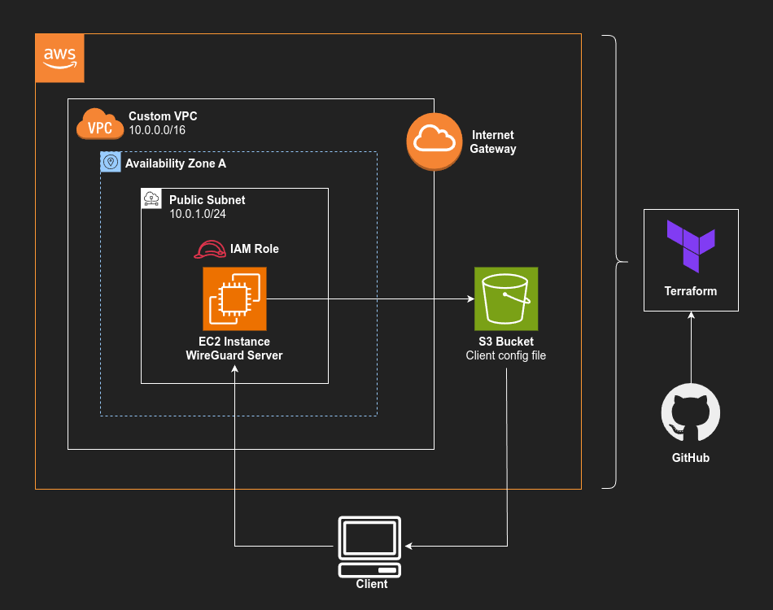

# CloudVPN
### Personal WireGuard VPN on AWS
A secure, automated VPN solution deployed on AWS using Terraform and WireGuard.  
Built as part of my cloud portfolio to demonstrate infrastructure as code (IaC), automation, and secure remote access architecture.

## Architecture


## Features
- Secure VPN server using WireGuard
- Custom VPC with public subnet and strict security groups
- EC2 instance with Ubuntu 24.04 AMI and auto-assigned public IP
- WireGuard client config uploaded to S3
- Fully deployed with Terraform (no manual setup required)
- Generate and saves key for SSH access
- Terraform outputs include Public IP, SSH command and config download URL

## Tech Stack
- **AWS EC2** - VPN server with Ubuntu 24.04 AMI
- **WireGuard** - Fast, lightweight VPN protocol
- **Amazon S3** - Client config storage
- **Terraform** - Infrastructure provisioning

## 🚀 Usage / How to Deploy

### Prerequisites

Make sure you have the following installed on your local machine:
- [Terraform](https://developer.hashicorp.com/terraform/downloads)
- [AWS CLI](https://docs.aws.amazon.com/cli/latest/userguide/install-cliv2.html)
- An AWS account with sufficient permissions (VPC, EC2, IAM, S3)
- An AWS CLI profile configured (`aws configure`)

### Clone the Repository
```bash
git clone https://github.com/jprk8/cloudvpn.git
cd cloudvpn/terraform
```

### Configure Variables
Edit terraform.tfvars to fit your needs. Key variables include:  
- project_name       = "cloudvpn"
- vpc_cidr           = "10.0.0.0/16"
- public_subnet_cidr = "10.0.1.0/24"
- availability_zone  = "us-west-1a"
- ami_id             = "ami-04f7a54071e74f488"

### Initialize and Deploy with Terraform
```bash
terraform init
terraform plan
terraform apply
```
Terraform will:
- Provision a custom VPC and subnet
- Launch an EC2 instance with WireGuard installed
- Upload your WireGuard client config file to an S3 bucket
- Save private key (.pem) file for EC2 SSH

### Terraform Output
After deployment, Terraform will output:
- download_client_config_command - Command to download your `.conf` file from S3
- vpn_ssh_command - Command to SSH into your EC2 instance

## 🔐 WireGuard Client Setup

Once your VPN server is deployed, you can connect to it from your local machine or mobile device using the generated WireGuard configuration.

### 1. Download Your Client Config

Terraform will output a command to download your client config file

```bash
aws s3 cp s3://your-bucket/wg-client.conf ./wg-client.conf
```

### 2. On Desktop (Linux/macOS/Windows)
* Install WireGuard:
  - Linux: sudo apt install WireGuard
  - macOS: [Install from App Store](https://apps.apple.com/us/app/wireguard/id1451685025)
  - Windows: [Download WireGuard](https://www.wireguard.com/install/)
* Import config using your WireGuard app

⚠️ On Linux, first move your client config file to /etc/wireguard directory
```bash
sudo mv ./wg-client.config /etc/wireguard
sudo wg-quick up wg-client
```
To disconnect:
```bash
sudo wg-quick down wg-client
```


## ✅ Clean Up Resources
To destroy everything when you're done:
```bash
terraform destroy
```